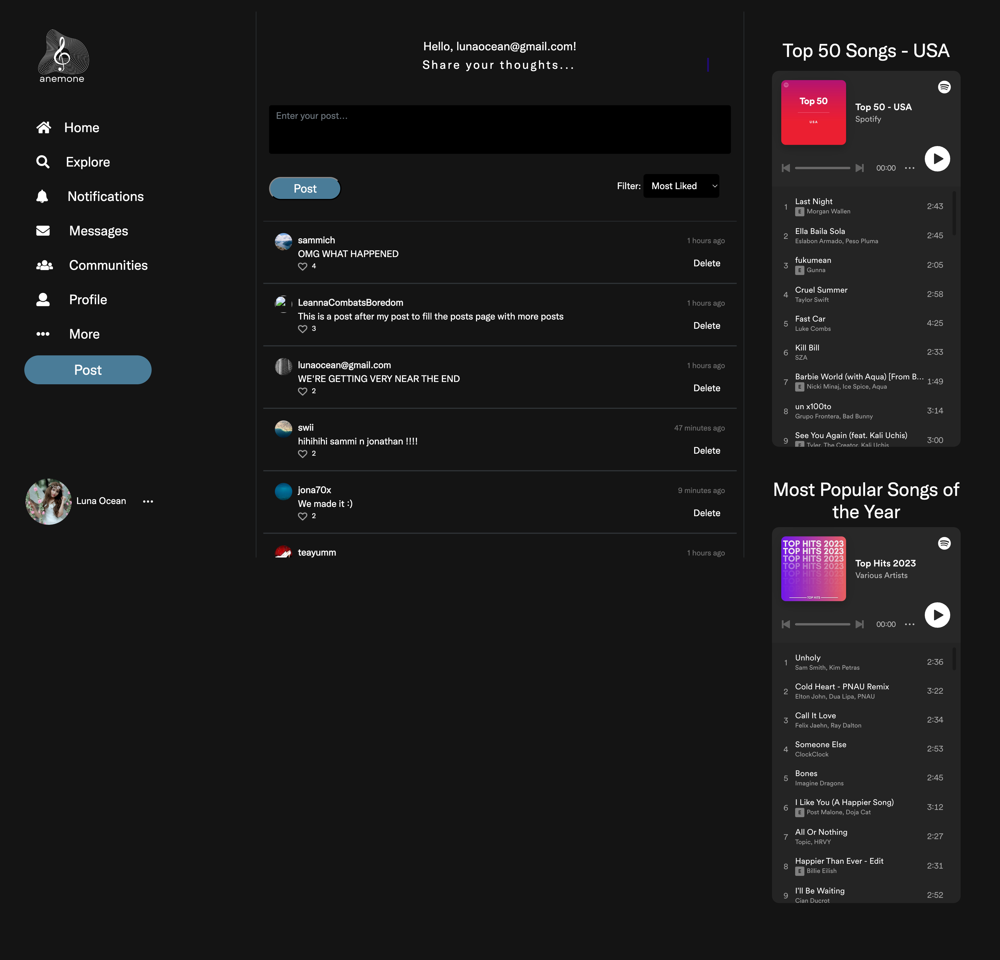

# Final Capstone Project
Week 12 Capstone Project of "anemone", a music discussion platform for Mailjard's class
 
(To download the code, click on the Release link up and to the right)

In this project, we created "anemone", a website that allows user to post discussion about music. It's inspired by Twitter and the old internet forums of the past.

There are 6 main pages in the website.

1) The intro page
2) The posts/home page
3) The profile page
4) The about page
5) The sign-up page
6) The log-in page

There is also a secret page that includes the real life livestream of Monterey Bay Aquarium's sea otter exhibit.

This whole site is the culmination of a creative process and we are very proud of "anemone".

